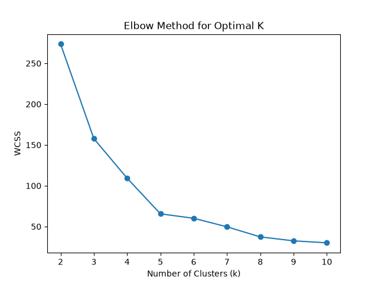
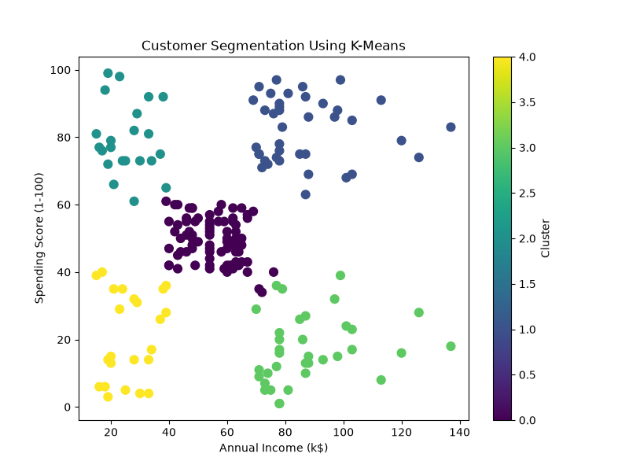
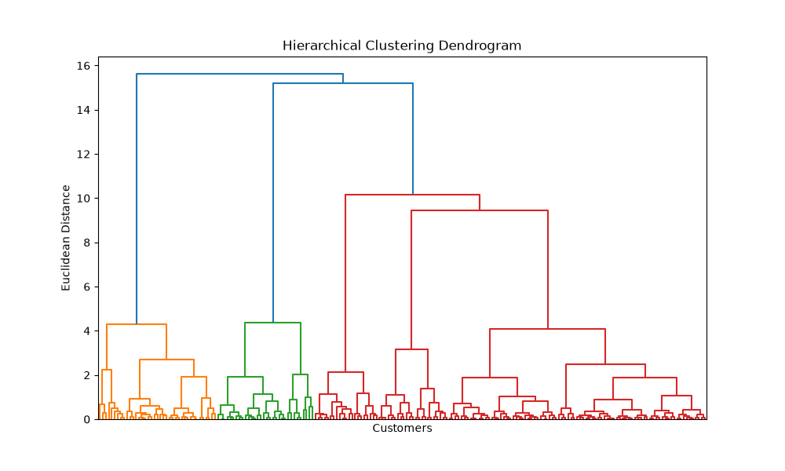
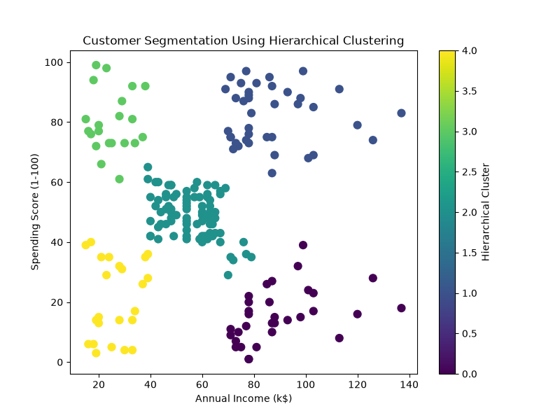
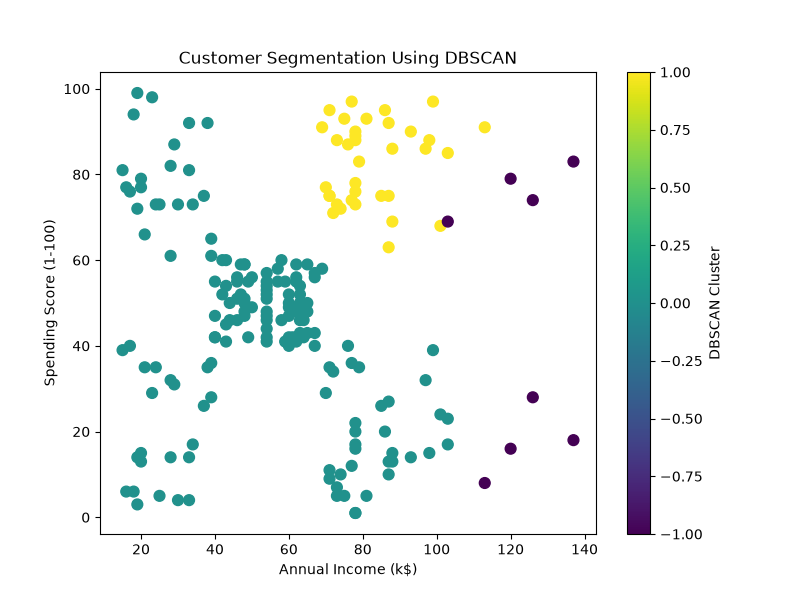

# Mall Customer Segmentation using Unsupervised Machine Learning

## Project Overview

This project performs customer segmentation using three popular unsupervised machine learning algorithms:

- K-Means Clustering
- Hierarchical (Agglomerative) Clustering
- DBSCAN (Density-Based Spatial Clustering)

The goal is to identify groups of customers based on their purchasing behavior so businesses can design targeted marketing strategies and improve customer engagement.

---

## Dataset

**Dataset:** Mall Customers Dataset

**Features Used:**

- Age
- Annual Income (k$)
- Spending Score (1-100)

Target variable is not available because this is an unsupervised learning problem.

---

## Project Workflow

1. Data Loading
2. Exploratory Data Analysis (EDA)
3. Data Cleaning
4. Feature Selection
5. Feature Scaling
6. K-Means Clustering
7. Elbow Method
8. Cluster Visualization
9. Cluster Analysis
10. Hierarchical Clustering
11. Dendrogram Visualization
12. DBSCAN Clustering
13. Comparison of Clustering Algorithms
14. Business Insights

---

## Technologies Used

- Python
- Pandas
- NumPy
- Matplotlib
- Scikit-learn
- SciPy

---

## Clustering Algorithms

### K-Means Clustering

- Used the Elbow Method to determine the optimal number of clusters.
- Selected **K = 5**.
- Silhouette Score: **0.5547**

---

### Hierarchical Clustering

- Applied Agglomerative Clustering using Ward Linkage.
- Used a Dendrogram to analyze cluster formation.
- Silhouette Score: **0.5538**

---

### DBSCAN

- Parameters:
  - eps = 0.5
  - min_samples = 5

Results:

- 2 Clusters
- 8 Noise Points

---

## Results

### Elbow Method

The Elbow Method was used to determine the optimal number of clusters. The optimal value of **K = 5** was selected.



---

### K-Means Clustering

The K-Means algorithm segmented customers into five distinct groups based on Annual Income and Spending Score.



---

### Hierarchical Clustering Dendrogram

The dendrogram illustrates how customers are merged into clusters and was used to determine the appropriate number of clusters.



---

### Hierarchical Clustering

Customer segmentation obtained using Agglomerative Hierarchical Clustering.



---

### DBSCAN Clustering

DBSCAN identified dense customer groups and automatically detected noise (outliers).



## Comparison of Algorithms

| Algorithm               | Number of Clusters | Noise Points | Silhouette Score |
| ----------------------- | -----------------: | -----------: | ---------------: |
| K-Means                 |                  5 |            0 |           0.5547 |
| Hierarchical Clustering |                  5 |            0 |           0.5538 |
| DBSCAN                  |                  2 |            8 |              N/A |

---

## Key Findings

- K-Means achieved the highest Silhouette Score.
- Hierarchical Clustering produced results very similar to K-Means.
- DBSCAN automatically detected dense customer groups and identified outliers.
- K-Means provided the most interpretable customer segmentation for this dataset.

---

## Business Insights

The analysis identified multiple customer segments such as:

- Premium Customers
- Average Customers
- High Income - Low Spending Customers
- Low Income - High Spending Customers
- Low Value Customers

These customer groups can help businesses design personalized marketing campaigns, loyalty programs, and promotional strategies.

---

## Project Structure

```

Mall-Customer-Segmentation/

│

├── data/

│ └── Mall_Customers.csv

│

├── images/

│ ├── Elbow_Method.png

│ ├── Hierarchical_Dendrogram.png

│ ├── KMeans_Clusters.png

│ ├── DBSCAN_Customer_Segmentation.png

│ └── ...

│

├── notebooks/

│ └── Mall_Customer_Segmentation.ipynb

│

├── README.md

├── requirements.txt

└── .gitignore

```

---

## Future Improvements

- Hyperparameter tuning for DBSCAN
- Cluster profiling with additional customer attributes
- Interactive visualizations using Plotly
- Deploy the project as a web application

---

## Author

**Aditya Sunil Chakote**

GitHub: https://github.com/AdiChakote

LinkedIn: https://www.linkedin.com/in/adityachakote
